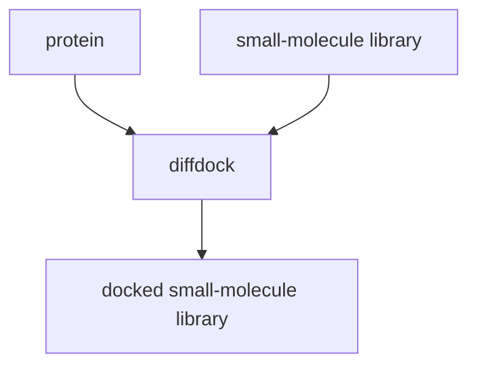

#cgas 

## Process

## notes
* Used for [[blind docking]] 
* part of [[diffusion models]]

##  claim
[[@corsoDiffDockDiffusionSteps2022]]

## hypothesis  
[[HYP - diffusion models engable sota fragment docking]]

## data 
[[time-split PDBind]] based on [[PDBind]] with complexes from 2018 and earlier for [[training data]] (17k instances) and 363 structures since 2019 as [[test data]] (363 unseen [[ligand]])

## idea 
extend the model by adding a .[[small molecule]] representation to the graph

## links
https://www.loom.com/share/4627d08ae27e4ca0b80a1f4ed0d2a7ad
[Papers with Code - PDBBind Benchmark (Blind Docking)](https://paperswithcode.com/sota/blind-docking-on-pdbbind?p=diffdock-diffusion-steps-twists-and-turns-for)
[https://github.com/labdao-apps/diffdock](https://github.com/labdao-apps/diffdock)
[Diffdock - a Hugging Face Space by simonduerr](https://huggingface.co/spaces/simonduerr/diffdock)