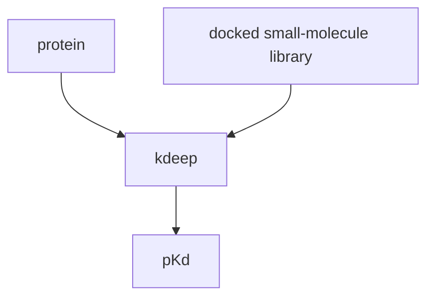

#cgas 
## about
winner of the [[CASF-2016]] challenge

## process

## accessibility
reference implementation:
https://www.playmolecule.com/Kdeep/

other implementations:
https://github.com/hassanmohsin/DLSCORE-CNN
https://github.com/abdulsalam-bande/KDeep

## dependencies
based on [[schnet]]
built with [[TorchMD]]

## [[affinity prediction]]
predicts the [[pKd]] of [[Protein-Ligand Docking]] performance metric is (for [[PDBind core set]]) v2016
* [[affinity regression]] - [[RMSD]] - 1.27 (better than [[rf score]] and others)
* [[affinity ranking]] - [[spearman correlation]] - 0.82 (also best in class)

